# MiniProject_Simple MRP

C#과 Python을 이용한 미니 공정 시뮬레이션 프로그램을 프로젝트 형식으로 설계 및 구현하는 과정을 작성했습니다.<br/>

```console
문서화(액셀, 파워포인트) -> 프로그램 프로토타입/UI 설계 -> DB 테이블 모델링 -> 프로그램 프로토타입/UI 일부 구현 
-> 칼라 인식 센서 작동 확인 -> MQTT 브로커 구축 및 클라이언트 접속 확인 (라즈베리파이 : 텔넷, 서버 : MQTT Explorer) 
-> MQTT Publisher/Subscriber 프로그램 구현 (Publisher : 파이썬, Subscriber(Daemon) : 윈폼) 
```

## 1. 요구사항 설계 문서

<p align="center">
    <br/> 
    <span><b>프로젝트 일정계획 관리(WBS)</b></span>
</p>

---

<p align="center">
    <br/>
    <span><b>프로젝트 요구사항 정의</b></span>
</p>

---

<p align="center">
    <br/>
    <span><b>프로젝트 To Be 프로세스</b></span>
</p>

---

<p align="center">
    <br/>
    <span><b>애플리케이션 설계서(기본설정)</b></span>
</p>

<p align="center">
    <br/>
    <span><b>애플리케이션 설계서(공정계획)</b></span>
</p>

<p align="center">
    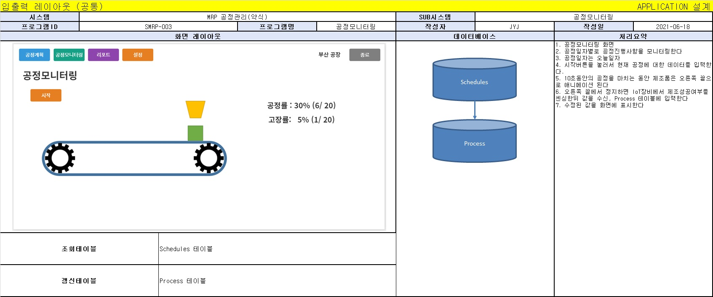<br/>
    <span><b>애플리케이션 설계서(공정모니터링)</b></span>
</p>

<p align="center">
    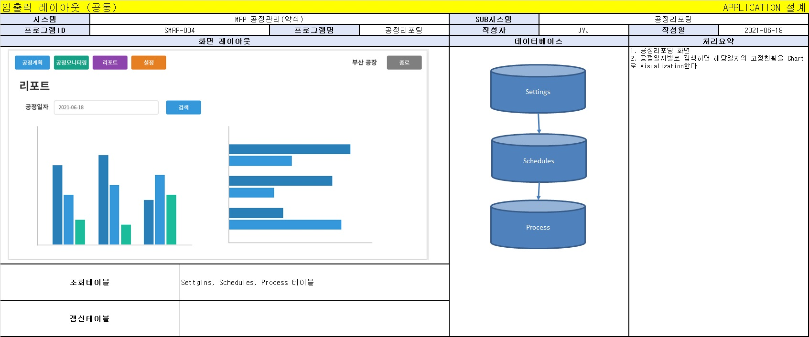<br/>
    <span><b>애플리케이션 설계서(공정리포팅)</b></span>
</p>

---

<p align="center">
    <br/>
    <span><b>테이블 기술서(Settings)</b></span>
</p>

<p align="center">
    <br/>
    <span><b>테이블 기술서(Schedules)</b></span>
</p>

<p align="center">
    <br/>
    <span><b>테이블 기술서(Process)</b></span>
</p>

---

<p align="center">
    <br/>
    <span><b>개발 리스트(가상)</b></span>
</p>

---

## 2. 프로그램 프로토타입/UI 설계

<p align="center">
    <br/>
    <span><b>프로그램 프로토타입/UI(기본설정화면)</b></span>
</p>

<p align="center">
    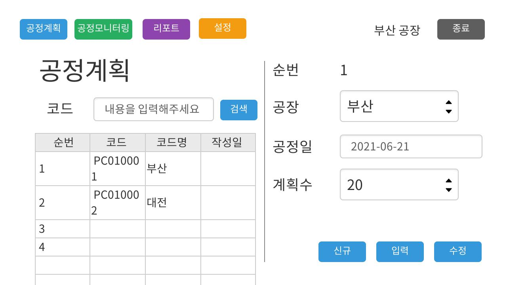<br/>
    <span><b>프로그램 프로토타입/UI(공정계획)</b></span>
</p>

<p align="center">
    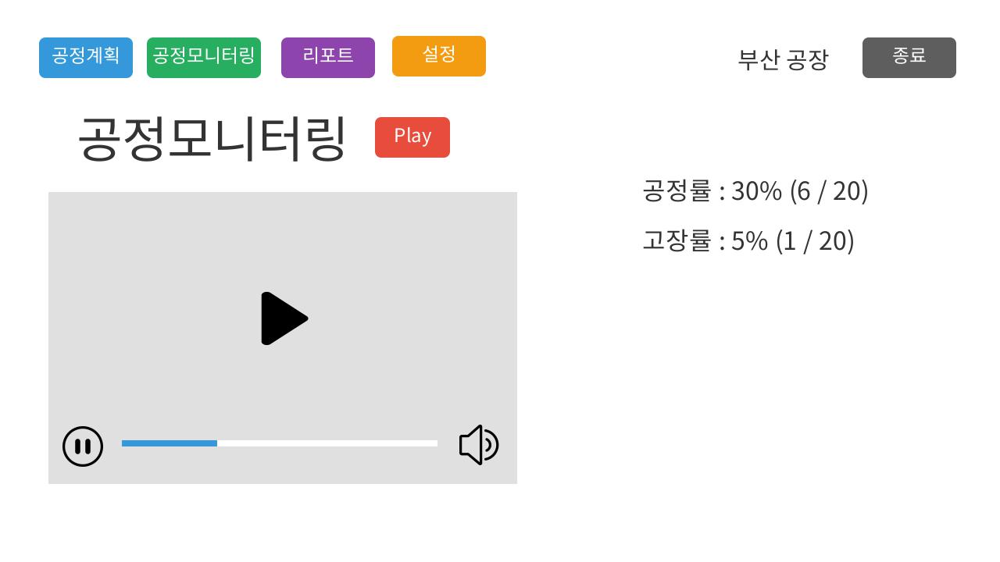<br/>
    <span><b>프로그램 프로토타입/UI(공정모니터링)</b></span>
</p>

<p align="center">
    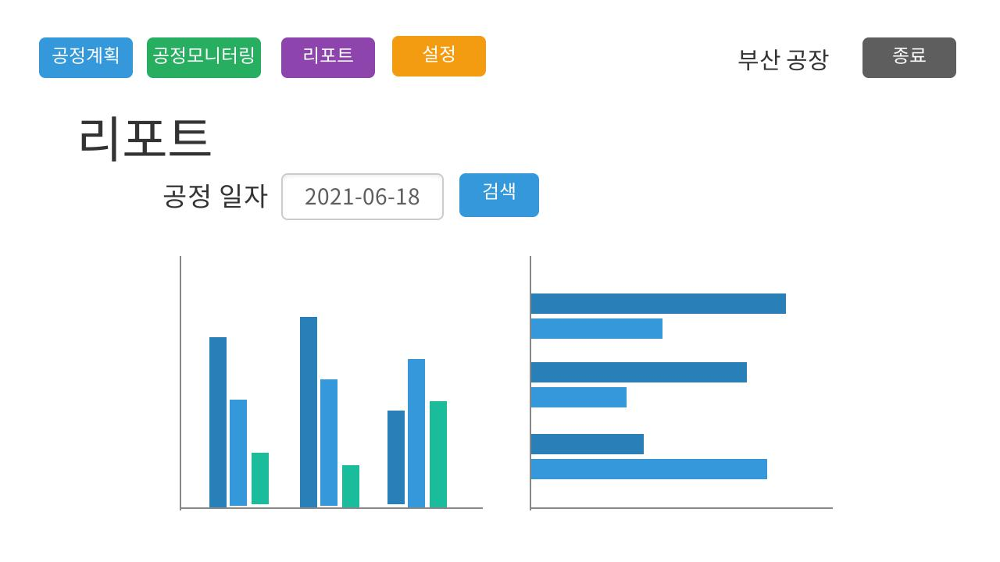<br/>
    <span><b>프로그램 프로토타입/UI(리포트)</b></span>
</p>

## 3. Database 테이블 모델링

<p align="center">
    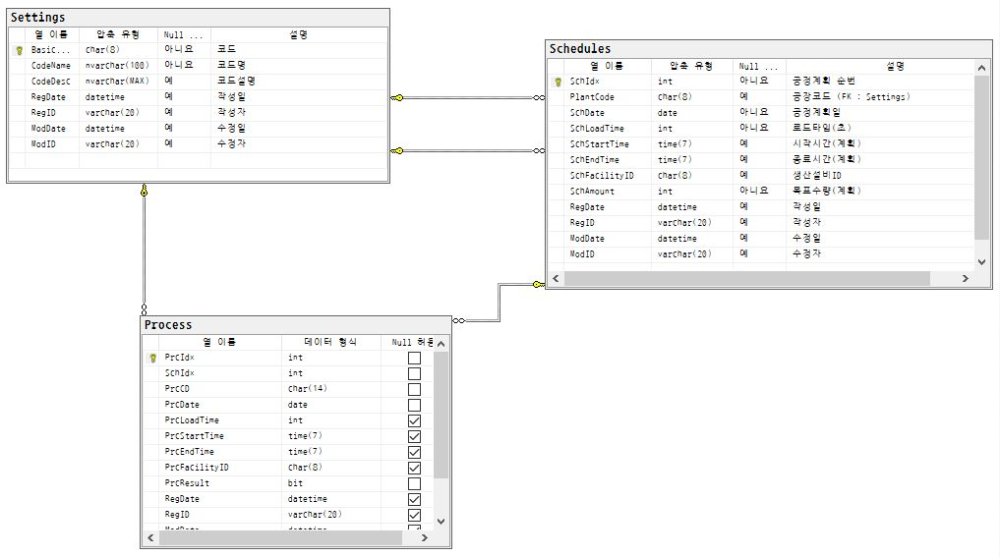<br/>
    <span><b>Database 테이블 모델링</b></span>
</p>

## 4. 프로그램 프로토타입/UI 일부 구현

<p align="center">
    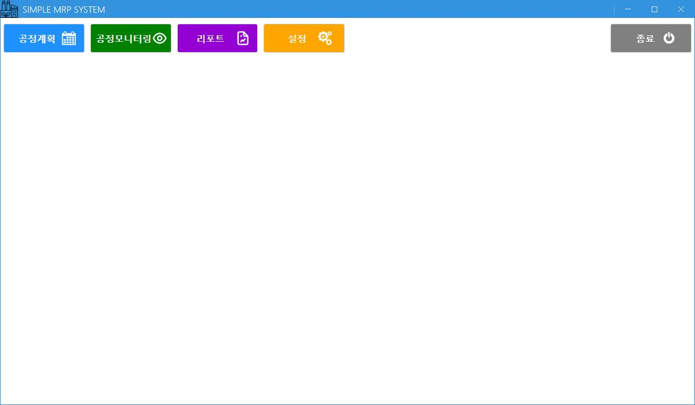<br/>
    <span><b>프로그램 UI 일부 구현</b></span>
</p>

## 5. 칼라 인식 센서 작동 확인

<p align="center">
    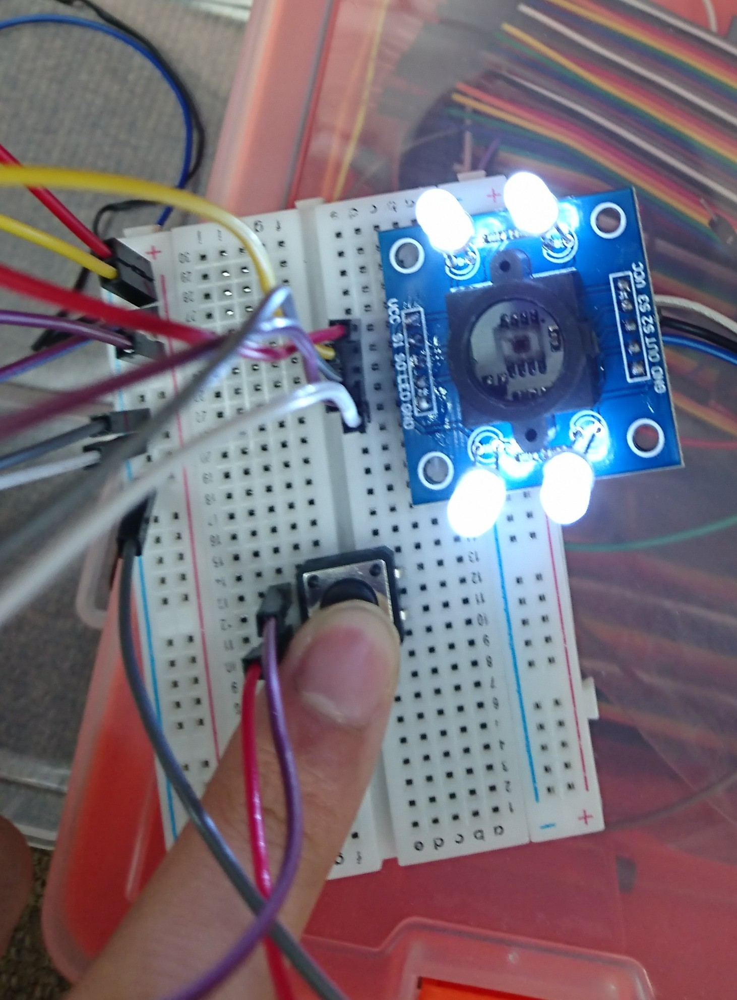<br/>
    <span><b>칼라 인식 센서 작동 확인</b></span>
</p>

## 6. MQTT 브로커 구축 및 클라이언트 접속 확인 (라즈베리파이 : 텔넷, 서버 : MQTT Explorer)

<p align="center">
    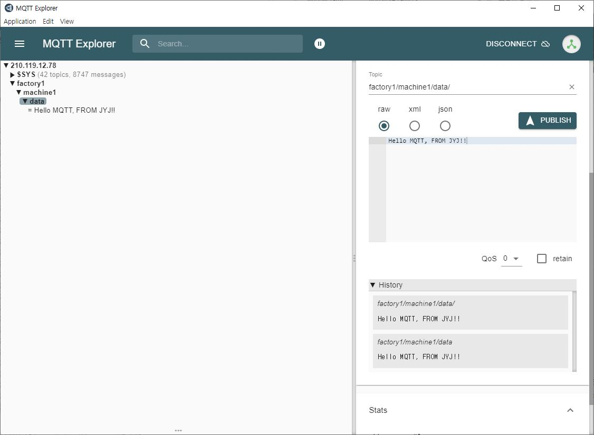<br/>
    <span><b>MQTT 서버 확인</b></span>
</p>


<p align="center">
    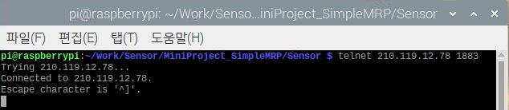<br/>
    <span><b>MQTT 클라이언트 확인</b></span>
</p>

## 7. MQTT Publisher/Subscriber 프로그램 구현 (Publisher : 파이썬, Subscriber(Daemon) : 윈폼)

---

<p align="center">
    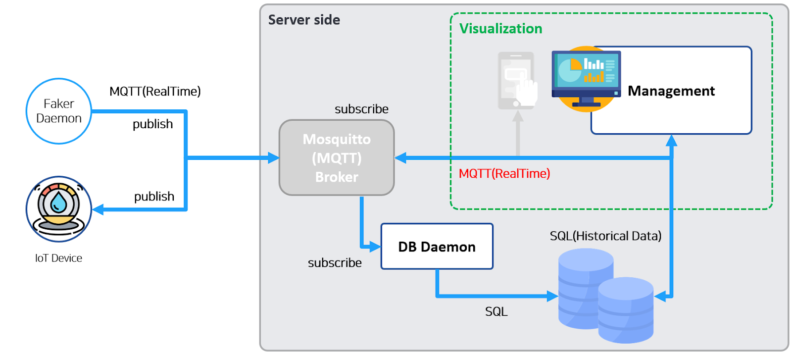<br/>
    <span><b>MQTT 구성 설계</b></span>
</p>

---

<p align="center">
    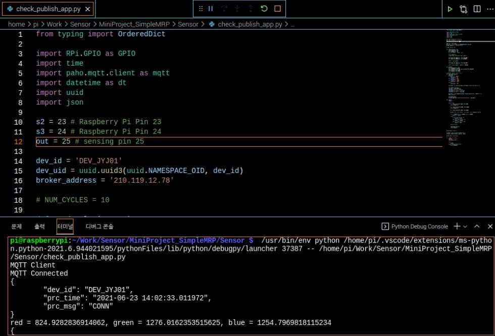<br/>
    <span><b>MQTT Publisher Program</b></span>
</p>

<p align="center">
    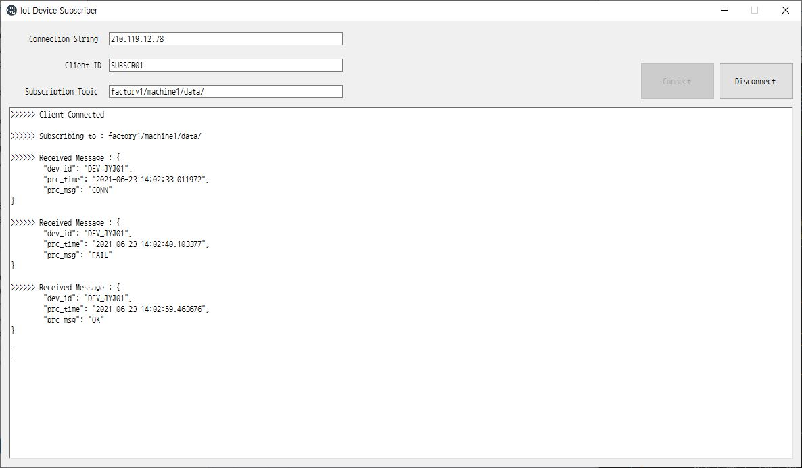<br/>
    <span><b>MQTT Subscriber Program</b></span>
</p>
